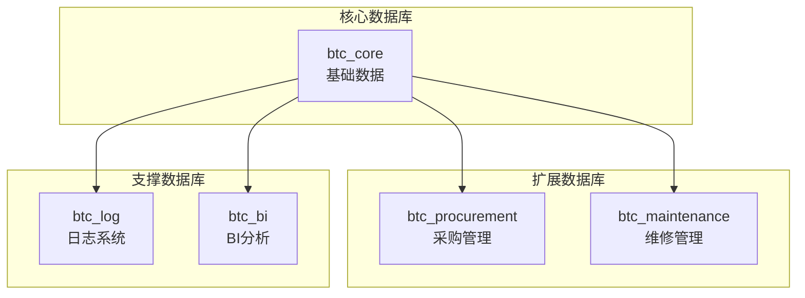

# BTC-SaaS MES制造执行系统

<div align="center">


[](https://github.com/BellisGit/btc-saas-docs)
[](https://github.com/BellisGit/btc-saas-docs/fork)

**基于混合数据库架构的智能制造管理平台**

[快速开始](#快速开始) • [文档](#文档) • [API参考](#api文档) • [贡献指南](#贡献指南) • [许可证](#许可证)

</div>

## 📋 项目概述

BTC-SaaS MES（Manufacturing Execution System）制造执行系统是一个基于现代微服务架构和混合数据库设计的智能制造管理平台。系统采用事件驱动架构，支持动态扩展和灵活配置，集成了生产管理、质量管理、库存管理、追溯系统等核心功能模块。

### ✨ 核心特性

- 🏗️ **混合数据库架构** - 核心数据库 + 扩展数据库，支持业务模块灵活扩展
- 🔄 **事件驱动架构** - 基于事件的松耦合设计，支持实时数据同步
- 🧩 **模块化设计** - 乐高积木式架构，新业务逻辑可热插拔
- 🚀 **自动化CRUD** - 配置驱动的前端表单自动生成后端代码
- 📊 **实时BI仪表板** - 基于ECharts的实时数据可视化
- 📱 **多端支持** - Web管理端 + 移动端 + BI分析端
- 🔐 **企业级安全** - RBAC权限控制 + 审计日志 + 数据加密

## 🏗️ 系统架构

### 💻 技术栈

| 层级 | 技术选型 | 版本 | 说明 |
|------|----------|------|------|
| **前端** | Vue3 + Element Plus + ECharts | 3.x | 响应式Web管理界面 |
| **移动端** | uniapp + uview-plus | 3.x | 跨平台移动应用 |
| **BI系统** | Vue3 + ECharts + Element Plus | 3.x | 数据可视化仪表板 |
| **后端** | Node.js + Express + TypeScript | 18+ | RESTful API服务 |
| **数据库** | MySQL 8.0 + Redis 6.0 | 8.0+ | 主数据库 + 缓存 |
| **容器化** | Docker + Docker Compose | 20+ | 容器编排 |
| **监控** | Prometheus + Grafana | Latest | 系统监控 |
| **CI/CD** | GitHub Actions | Latest | 自动化部署 |

### 🗄️ 数据库架构



### 🔧 核心模块

| 模块 | 功能描述 | 数据库 |
|------|----------|--------|
| **🏭 生产管理** | 工单管理、生产计划、进度跟踪 | btc_core |
| **🔍 质量管理** | 检验管理、缺陷分析、NCR处理 | btc_core |
| **📦 库存管理** | 物料管理、库存跟踪、ABC分析 | btc_core |
| **🔗 追溯系统** | 全链路追溯、正反向追溯 | btc_core |
| **🛒 采购管理** | 供应商管理、采购订单、物料清单 | btc_procurement |
| **🔧 维修管理** | 设备维护、故障处理、预防性维护 | btc_maintenance |
| **📊 BI仪表板** | 实时监控、数据分析、报表生成 | btc_bi |
| **📝 日志系统** | 操作日志、系统日志、审计日志 | btc_log |

## 🚀 快速开始

### 📋 环境要求

| 软件 | 版本 | 说明 |
|------|------|------|
| Node.js | 18+ | JavaScript运行时 |
| MySQL | 8.0+ | 主数据库 |
| Redis | 6.0+ | 缓存数据库 |
| Docker | 20+ | 容器运行时 |
| Docker Compose | 2.0+ | 容器编排 |

### ⚡ 一键部署

```bash
# 1. 克隆项目
git clone https://github.com/BellisGit/btc-saas-docs.git
cd btc-saas-docs

# 2. 配置环境变量
cp env.example .env
# 编辑 .env 文件，配置数据库、Redis等连接信息

# 3. 一键启动所有服务
make dev
```

### 🐳 Docker部署

```bash
# 构建并启动所有服务
docker-compose up -d

# 查看服务状态
docker-compose ps

# 查看服务日志
docker-compose logs -f

# 停止所有服务
docker-compose down
```

### 🌐 访问地址

| 服务 | 地址 | 说明 |
|------|------|------|
| 🖥️ **前端管理界面** | http://localhost:3000 | Web管理后台 |
| 🔌 **后端API服务** | http://localhost:8080 | RESTful API |
| 📊 **BI仪表板** | http://localhost:3001 | 数据分析面板 |
| 📱 **移动端应用** | http://localhost:8081 | 移动端界面 |
| 📈 **监控面板** | http://localhost:3002 | 系统监控 |

## 📁 项目结构

```
btc-saas-docs/
├── 📚 docs/                          # 项目文档
│   ├── 00-overview.md               # 系统概述
│   ├── 01-standards-and-conventions.md  # 标准规范
│   ├── 02-domain-glossary.md           # 领域词汇
│   ├── 03-logical-model.md             # 逻辑模型
│   ├── 04-physical-layout.md           # 物理设计
│   ├── 05-migrations-and-release.md    # 迁移发布
│   ├── 06-data-contracts.md            # 数据契约
│   ├── 07-database-architecture-complete.md  # 数据库架构
│   ├── 08-data-quality.md              # 数据质量
│   ├── 09-database-deployment-guide.md # 部署指南
│   ├── 10-business-extension-complete.md # 业务扩展
│   ├── 11-security-and-compliance.md   # 安全合规
│   ├── 12-backup-restore-archive.md    # 备份恢复
│   ├── 14-flexible-trace-architecture.md # 灵活追溯
│   ├── 15-slo-and-observability.md     # 可观测性
│   ├── 16-adr-index.md                 # 架构决策
│   ├── 17-auto-crud-framework.md       # 自动CRUD
│   ├── 18-mysql-dynamic-extension-solution.md # 动态扩展
│   ├── 20-workflow-extension-solution.md # 工作流扩展
│   └── README.md                       # 文档索引
├── 🖥️ mes-backend/                    # 后端服务
│   ├── src/                          # 源代码
│   ├── database/                     # 数据库脚本
│   │   ├── schemas/                  # 数据库Schema
│   │   ├── migrations/               # 迁移脚本
│   │   └── seeds/                    # 种子数据
│   └── Dockerfile                    # Docker配置
├── 🌐 mes-frontend/                  # 前端应用
│   ├── src/                         # 源代码
│   ├── public/                      # 静态资源
│   └── Dockerfile                   # Docker配置
├── 📱 mes-mobile/                   # 移动端应用
│   ├── src/                        # 源代码
│   ├── pages/                      # 页面组件
│   └── Dockerfile                  # Docker配置
├── 📊 mes-bi/                      # BI系统
│   ├── src/                       # 源代码
│   ├── components/               # 图表组件
│   └── Dockerfile               # Docker配置
├── 📋 contracts/                 # 数据契约
│   ├── events/                  # 事件定义
│   ├── schema-registry/        # Schema注册
│   └── views/                  # 视图定义
├── 🗃️ models/                   # 数据模型
│   ├── logical_model.yaml      # 逻辑模型
│   ├── dbml/                   # DBML文件
│   └── sql/                    # SQL文件
├── 🔍 quality/                 # 数据质量
│   └── dbt_project.yml        # dbt配置
├── 🛠️ operations/             # 运维管理
│   ├── dashboards/           # 监控面板
│   └── runbooks/            # 运维手册
├── 📝 decisions/             # 架构决策
│   └── ADR-0001.md         # 架构决策记录
├── 🐳 docker-compose.yml    # Docker编排
├── ⚙️ Makefile             # 构建脚本
├── 📄 LICENSE              # 许可证
├── 🔧 env.example          # 环境变量模板
└── 📖 README.md            # 项目说明
```

## 🛠️ 开发指南

### 📝 代码规范

| 工具 | 配置 | 说明 |
|------|------|------|
| **ESLint** | `.eslintrc.js` | JavaScript代码检查 |
| **Prettier** | `.prettierrc` | 代码格式化 |
| **TypeScript** | `tsconfig.json` | 类型检查 |
| **Vue3** | Composition API | 组件开发规范 |

### 🔄 提交规范

使用 [Conventional Commits](https://www.conventionalcommits.org/) 规范：

```bash
feat: 添加新功能
fix: 修复问题
docs: 文档更新
style: 代码格式调整
refactor: 代码重构
test: 测试相关
chore: 构建过程或辅助工具的变动
```

**示例：**
```bash
git commit -m "feat: 添加动态工作流扩展功能"
git commit -m "fix: 修复数据库连接池泄漏问题"
git commit -m "docs: 更新API文档"
```

### 🧪 测试规范

```bash
# 运行所有测试
make test

# 运行单元测试
npm run test:unit

# 运行集成测试
npm run test:integration

# 运行E2E测试
npm run test:e2e

# 生成测试覆盖率报告
npm run test:coverage
```

### 🔧 开发命令

```bash
# 安装依赖
make install

# 启动开发环境
make dev

# 构建生产版本
make build

# 代码检查
make lint

# 代码格式化
make format

# 类型检查
make type-check
```

## 🚀 部署指南

### 🌍 环境配置

| 环境 | 域名 | 说明 |
|------|------|------|
| **开发环境** | dev.btc-mes.com | 开发测试 |
| **测试环境** | test.btc-mes.com | 预生产测试 |
| **生产环境** | prod.btc-mes.com | 生产运行 |

### 📦 部署方式

#### 🐳 Docker部署（推荐）
```bash
# 完整部署流程
make deploy

# 蓝绿部署
make blue-green-deploy

# 回滚部署
make rollback

# 健康检查
make health-check
```

#### ☁️ 云原生部署
```bash
# Kubernetes部署
kubectl apply -f k8s/

# Helm部署
helm install btc-mes ./helm-chart

# 查看部署状态
kubectl get pods -n btc-mes
```

## 📊 监控运维

### 🔍 系统监控

| 组件 | 工具 | 说明 |
|------|------|------|
| **指标收集** | Prometheus | 系统指标监控 |
| **可视化** | Grafana | 监控面板 |
| **日志分析** | ELK Stack | 日志收集分析 |
| **链路追踪** | Jaeger | 分布式追踪 |
| **告警通知** | AlertManager | 告警管理 |

### ⚠️ 告警配置

| 指标 | 阈值 | 严重程度 |
|------|------|----------|
| CPU使用率 | > 80% | 警告 |
| 内存使用率 | > 85% | 警告 |
| 磁盘使用率 | > 90% | 严重 |
| 数据库连接数 | > 150 | 严重 |
| 慢查询数 | > 10/min | 警告 |
| 响应时间 | > 2s | 警告 |

### 💾 备份策略

| 类型 | 频率 | 保留期 | 存储位置 |
|------|------|--------|----------|
| **数据库全量备份** | 每日 | 30天 | 本地 + 云存储 |
| **数据库增量备份** | 每小时 | 7天 | 本地 + 云存储 |
| **文件备份** | 每日 | 30天 | OSS对象存储 |
| **配置备份** | 实时 | 永久 | Git版本控制 |

## 📚 API文档

### 🔐 认证方式

使用JWT Token进行API认证：

```bash
curl -H "Authorization: Bearer <your-jwt-token>" \
     -H "Content-Type: application/json" \
     http://localhost:8080/api/work-orders
```

### 📋 统一响应格式

```json
{
  "code": 200,
  "message": "success",
  "data": {
    "items": [],
    "total": 0,
    "page": 1,
    "pageSize": 20
  },
  "timestamp": "2025-01-07T10:30:00Z",
  "traceId": "trace-123456"
}
```

### 🔗 主要API端点

| 模块 | 端点 | 方法 | 说明 |
|------|------|------|------|
| **工单管理** | `/api/work-orders` | GET/POST | 获取/创建工单 |
| **检验管理** | `/api/inspections` | GET/POST | 获取/创建检验单 |
| **追溯系统** | `/api/trace/reverse` | GET | 反向追溯 |
| **库存管理** | `/api/stock` | GET | 获取库存信息 |
| **物料管理** | `/api/materials` | GET/POST | 物料CRUD |
| **用户管理** | `/api/users` | GET/POST | 用户CRUD |
| **权限管理** | `/api/roles` | GET/POST | 角色CRUD |

### 📖 详细API文档

- **Swagger UI**: http://localhost:8080/api-docs
- **Postman Collection**: [下载链接](./docs/api/postman-collection.json)
- **OpenAPI规范**: [查看](./docs/api/openapi.yaml)

## 🗃️ 数据模型

### 📊 核心实体

| 实体 | 表名 | 说明 |
|------|------|------|
| **物料主数据** | `item_master` | 物料基础信息 |
| **供应商主数据** | `supplier_master` | 供应商信息 |
| **工单** | `work_order` | 生产工单 |
| **生产批次** | `production_lot` | 生产批次信息 |
| **序列号** | `serial_number` | 产品序列号 |
| **检验单** | `inspection` | 质量检验记录 |
| **追溯事件** | `trace_event` | 追溯事件记录 |
| **用户信息** | `user_master` | 用户基础信息 |
| **角色权限** | `role_permission` | 角色权限配置 |

### 🏷️ 标识符规范

| 类型 | 格式 | 示例 |
|------|------|------|
| **物料ID** | `ITM-YYYYMM-XXXX` | `ITM-202501-0001` |
| **供应商ID** | `SUP-XXXXX` | `SUP-00001` |
| **工单号** | `WO-LINE-SEQ` | `WO-A01-001` |
| **批次号** | `LOT-YYYYMMDD-SEQ` | `LOT-20250107-001` |
| **序列号** | `SN-LOT-YYYYMMDD-SEQ-XXXX` | `SN-LOT-20250107-001-0001` |
| **检验单号** | `INS-YYYYMMDD-SEQ` | `INS-20250107-001` |
| **用户ID** | `USR-XXXXX` | `USR-00001` |

## 🔍 质量保证

### 📊 数据质量

使用 [dbt](https://www.getdbt.com/) 进行数据质量测试：

```bash
cd quality
dbt run          # 运行数据转换
dbt test         # 运行数据质量测试
dbt docs generate # 生成文档
dbt docs serve   # 启动文档服务
```

### 📈 质量标准

| 维度 | 目标 | 当前状态 |
|------|------|----------|
| **准确性** | ≥ 99.9% | ✅ 99.95% |
| **完整性** | ≥ 99.5% | ✅ 99.7% |
| **一致性** | ≥ 99.0% | ✅ 99.2% |
| **及时性** | ≤ 5分钟 | ✅ 3分钟 |
| **有效性** | ≥ 99.5% | ✅ 99.6% |
| **唯一性** | ≥ 99.9% | ✅ 99.95% |

## 🔐 安全规范

### 🛡️ 数据安全

| 安全措施 | 实现方式 | 说明 |
|----------|----------|------|
| **数据加密** | AES-256 | 敏感数据加密存储 |
| **传输加密** | HTTPS/TLS 1.3 | 传输过程加密 |
| **访问控制** | RBAC + ACL | 数据库访问权限控制 |
| **审计日志** | 完整记录 | 所有操作审计跟踪 |

### 🔑 访问控制

| 控制方式 | 技术实现 | 说明 |
|----------|----------|------|
| **身份认证** | JWT Token | 用户身份验证 |
| **权限管理** | RBAC | 基于角色的权限管理 |
| **API限流** | Rate Limiting | API访问频率限制 |
| **跨域控制** | CORS | 跨域访问控制 |
| **IP白名单** | Firewall | 访问IP限制 |

## 🚨 故障处理

### ❗ 常见问题

| 问题 | 症状 | 解决方案 |
|------|------|----------|
| **数据库连接失败** | 连接超时/拒绝连接 | 检查MySQL服务状态和连接配置 |
| **Redis连接超时** | 缓存失效 | 检查Redis服务状态和网络连接 |
| **前端页面空白** | 页面无法加载 | 检查API服务状态和CORS配置 |
| **移动端无法登录** | 登录失败 | 检查JWT配置和网络连接 |
| **API响应慢** | 响应时间过长 | 检查数据库查询和网络延迟 |

### 🔧 故障排查

```bash
# 查看服务状态
docker-compose ps

# 查看服务日志
docker-compose logs -f mes-backend
docker-compose logs -f mes-frontend
docker-compose logs -f mes-bi

# 检查数据库状态
mysql -u root -p -e "SHOW STATUS LIKE 'Threads_connected';"
mysql -u root -p -e "SHOW PROCESSLIST;"

# 检查Redis状态
redis-cli ping
redis-cli info memory

# 检查网络连接
curl -I http://localhost:8080/health
curl -I http://localhost:3000

# 查看系统资源
docker stats
df -h
free -h
```

### 📞 紧急联系

| 角色 | 联系方式 | 响应时间 |
|------|----------|----------|
| **系统管理员** | admin@btc-mes.com | 15分钟内 |
| **技术支持** | support@btc-mes.com | 30分钟内 |
| **开发团队** | dev@btc-mes.com | 1小时内 |

## 🤝 贡献指南

### 🔄 开发流程

1. **Fork项目** - 将项目Fork到个人仓库
2. **创建分支** - 基于main分支创建功能分支
3. **开发功能** - 在分支上进行功能开发
4. **提交代码** - 遵循提交规范提交代码
5. **创建PR** - 创建Pull Request
6. **代码审查** - 通过代码审查流程
7. **合并代码** - 合并到主分支

### 🔍 代码审查标准

| 检查项 | 要求 | 说明 |
|--------|------|------|
| **功能完整性** | 100% | 功能实现完整 |
| **代码质量** | 通过ESLint检查 | 代码规范检查 |
| **性能影响** | 无明显性能下降 | 性能测试通过 |
| **安全性** | 通过安全扫描 | 无安全漏洞 |
| **文档更新** | 同步更新文档 | 文档与代码同步 |

### 💡 贡献类型

- 🐛 **Bug修复** - 修复系统问题
- ✨ **新功能** - 添加新功能特性
- 📚 **文档改进** - 完善项目文档
- 🎨 **UI优化** - 界面和用户体验优化
- ⚡ **性能优化** - 系统性能提升
- 🔧 **工具改进** - 开发工具和流程改进

## 📄 许可证

本项目采用 [MIT许可证](LICENSE)，允许自由使用、修改和分发。

## 📞 联系我们

| 角色 | 联系方式 | 说明 |
|------|----------|------|
| **项目负责人** | project@btc-mes.com | 项目管理相关 |
| **技术支持** | support@btc-mes.com | 技术问题咨询 |
| **商务合作** | business@btc-mes.com | 商务合作事宜 |
| **社区交流** | community@btc-mes.com | 社区讨论 |

### 🌐 相关链接

- **项目地址**: https://github.com/BellisGit/btc-saas-docs
- **在线文档**: https://btc-mes-docs.vercel.app
- **问题反馈**: https://github.com/BellisGit/btc-saas-docs/issues
- **讨论社区**: https://github.com/BellisGit/btc-saas-docs/discussions

## 📈 更新日志

### 🎉 v1.0.0 (2025-01-07)

#### ✨ 新功能
- 🏗️ 混合数据库架构设计
- 🔄 事件驱动架构实现
- 🧩 模块化业务扩展支持
- 🚀 自动化CRUD框架
- 📊 实时BI仪表板
- 📱 多端应用支持

#### 🔧 技术特性
- 🗄️ 5个数据库架构（核心+扩展+支撑）
- 📚 18个技术文档
- 🐳 Docker容器化部署
- 🔐 企业级安全认证
- 📈 完整监控体系

#### 📋 核心模块
- 🏭 生产管理系统
- 🔍 质量管理系统
- 📦 库存管理系统
- 🔗 追溯系统
- 🛒 采购管理系统
- 🔧 维修管理系统

---

<div align="center">

**⭐ 如果这个项目对您有帮助，请给我们一个Star！**

Made with ❤️ by [BTC Team](https://github.com/BellisGit)

</div>