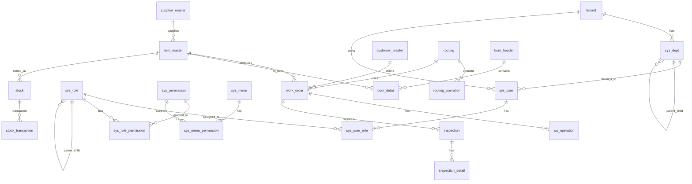

# BTC-SaaS MES系统 数据库表结构清单

## 📋 概述

本文档整理了BTC-SaaS MES系统中所有数据库表的完整清单，按数据库和功能模块分类，方便进行表结构的增删操作。

**统计信息：**
- 总数据库数量：**5个**
- 总表数量：**约132张表**
- 核心业务表：**45张**
- BI聚合表：**47张**
- 日志表：**25张**
- 系统管理表：**15张**

---

## 🗄️ 数据库架构

### 1. **btc_core** - 核心数据库 (45张表)
存储所有核心业务数据，支持复杂事务和强一致性要求。

### 2. **btc_procurement** - 采购管理数据库 (9张表)
存储采购相关的业务数据，独立扩展。

### 3. **btc_maintenance** - 维修管理数据库 (10张表)
存储维修相关的业务数据，独立扩展。

### 4. **btc_log** - 日志数据库 (15张表)
存储所有操作日志、系统日志、审计日志。

### 5. **btc_bi** - BI分析数据库 (47张表)
存储BI聚合数据、实时指标、报表数据、异常预警监控。

---

## 📊 详细表结构清单

## 🏗️ btc_core 数据库 (45张表)

### 1.1 系统基础表 (9张)

| 表名 | 中文名称 | 功能描述 | 主要字段 |
|------|----------|----------|----------|
| `tenant` | 租户管理表 | 多租户管理 | tenant_id, tenant_code, tenant_name |
| `sys_dept` | 部门表 | 部门组织架构 | dept_id, dept_code, dept_name, parent_id |
| `sys_user` | 用户表 | 系统用户管理 | user_id, username, email, phone, dept_id |
| `sys_role` | 角色表 | 角色定义（支持继承） | role_id, role_name, parent_role_id, role_level |
| `sys_permission` | 权限表 | 权限定义 | permission_id, permission_code, permission_type |
| `sys_menu` | 菜单表 | 系统菜单 | menu_id, menu_name, menu_url, path |
| `sys_menu_permission` | 菜单权限关联 | 菜单权限关联 | menu_id, permission_id |
| `sys_user_role` | 用户角色关联 | 用户角色分配 | user_id, role_id |
| `sys_role_permission` | 角色权限关联 | 角色权限分配 | role_id, permission_id |

### 1.2 主数据管理表 (6张)

| 表名 | 中文名称 | 功能描述 | 主要字段 |
|------|----------|----------|----------|
| `item_master` | 物料主数据 | 物料基础信息 | item_id, item_code, item_name |
| `supplier_master` | 供应商主数据 | 供应商信息 | supplier_id, supplier_code, supplier_name |
| `customer_master` | 客户主数据 | 客户信息 | customer_id, customer_code, customer_name |
| `location_master` | 库位主数据 | 仓库位置 | location_id, location_code, location_name |
| `defect_code_master` | 缺陷代码 | 质量缺陷定义 | defect_code, defect_name, severity |
| `cause_code_master` | 原因代码 | 缺陷原因定义 | cause_code, cause_name, category |

### 1.3 工厂配置表 (6张)

| 表名 | 中文名称 | 功能描述 | 主要字段 |
|------|----------|----------|----------|
| `plant` | 工厂表 | 工厂基础信息 | plant_id, plant_code, plant_name |
| `production_line` | 产线表 | 生产线信息 | line_id, line_code, line_name |
| `workstation` | 工位表 | 工位信息 | station_id, station_code, station_name |
| `equipment` | 设备表 | 设备信息 | equipment_id, equipment_code, equipment_name |
| `sensor` | 传感器表 | 传感器配置 | sensor_id, sensor_code, sensor_type |
| `skill` | 技能表 | 员工技能定义 | skill_id, skill_code, skill_name |

### 1.4 生产管理表 (6张)

| 表名 | 中文名称 | 功能描述 | 主要字段 |
|------|----------|----------|----------|
| `work_order` | 工单表 | 生产工单 | wo_id, wo_no, item_id, planned_qty |
| `routing` | 工艺路线 | 工艺路线定义 | routing_id, routing_code, item_id |
| `routing_operation` | 工艺工序 | 工艺工序定义 | operation_id, routing_id, operation_seq |
| `bom_header` | BOM表头 | 物料清单表头 | bom_id, item_id, version |
| `bom_detail` | BOM明细 | 物料清单明细 | bom_id, component_id, qty |
| `wo_operation` | 工单工序 | 工单工序执行 | wo_id, operation_id, status |

### 1.5 质量管理表 (4张)

| 表名 | 中文名称 | 功能描述 | 主要字段 |
|------|----------|----------|----------|
| `inspection_plan` | 检验计划 | 检验计划定义 | plan_id, plan_name, item_id |
| `inspection_item` | 检验项目 | 检验项目定义 | item_id, check_item, check_method |
| `inspection` | 检验单 | 质量检验记录 | inspection_id, wo_id, inspector_id |
| `inspection_detail` | 检验明细 | 检验结果明细 | inspection_id, check_item, result |

### 1.6 库存管理表 (5张)

| 表名 | 中文名称 | 功能描述 | 主要字段 |
|------|----------|----------|----------|
| `stock` | 库存表 | 库存信息 | stock_id, item_id, location_id, qty |
| `stock_transaction` | 库存交易 | 库存出入库记录 | transaction_id, item_id, transaction_type |
| `stock_reservation` | 库存预留 | 库存预留记录 | reservation_id, item_id, reserved_qty |
| `stock_count` | 盘点表 | 库存盘点 | count_id, count_date, status |
| `stock_count_detail` | 盘点明细 | 盘点结果明细 | count_id, item_id, counted_qty |

### 1.7 追溯管理表 (3张)

| 表名 | 中文名称 | 功能描述 | 主要字段 |
|------|----------|----------|----------|
| `dynamic_entity` | 动态实体 | 动态实体定义 | entity_id, entity_type, entity_name |
| `dynamic_attribute` | 动态属性 | 动态属性定义 | attr_id, entity_id, attr_name |
| `dynamic_attribute_value` | 动态属性值 | 动态属性值存储 | entity_id, attr_id, attr_value |

### 1.8 系统配置表 (6张)

| 表名 | 中文名称 | 功能描述 | 主要字段 |
|------|----------|----------|----------|
| `sys_config` | 系统配置 | 系统参数配置 | config_id, config_key, config_value |
| `sys_dict` | 数据字典 | 字典数据 | dict_id, dict_type, dict_key |
| `sys_parameter` | 系统参数 | 系统运行参数 | param_id, param_key, param_value |
| `sys_notification` | 系统通知 | 通知消息 | notification_id, title, content |
| `sys_job` | 系统任务 | 定时任务 | job_id, job_name, cron_expression |
| `employee_skill` | 员工技能 | 员工技能关联 | employee_id, skill_id, level |

---

## 🛒 btc_procurement 数据库 (9张表)

### 2.1 采购业务表 (7张)

| 表名 | 中文名称 | 功能描述 | 主要字段 |
|------|----------|----------|----------|
| `purchase_order` | 采购订单 | 采购订单主表 | po_id, po_no, supplier_id, status |
| `purchase_order_detail` | 采购订单明细 | 采购订单明细 | po_id, item_id, qty, unit_price |
| `purchase_receipt` | 采购收货单 | 采购收货记录 | receipt_id, po_id, receipt_date |
| `purchase_receipt_detail` | 采购收货明细 | 采购收货明细 | receipt_id, item_id, received_qty |
| `supplier_evaluation` | 供应商评价 | 供应商绩效评价 | eval_id, supplier_id, score |
| `purchase_contract` | 采购合同 | 采购合同管理 | contract_id, supplier_id, contract_no |
| `purchase_contract_detail` | 采购合同明细 | 采购合同明细 | contract_id, item_id, contract_qty |

### 2.2 BI聚合表 (1张)

| 表名 | 中文名称 | 功能描述 | 主要字段 |
|------|----------|----------|----------|
| `agg_procurement_performance_1d` | 采购绩效聚合 | 每日采购绩效统计 | agg_date, supplier_id, metrics |

### 2.3 数据同步表 (1张)

| 表名 | 中文名称 | 功能描述 | 主要字段 |
|------|----------|----------|----------|
| `core_data_sync` | 核心数据同步 | 与核心数据库同步 | sync_id, sync_type, last_sync_time |

---

## 🔧 btc_maintenance 数据库 (10张表)

### 3.1 维修业务表 (8张)

| 表名 | 中文名称 | 功能描述 | 主要字段 |
|------|----------|----------|----------|
| `maintenance_plan` | 维修计划 | 设备维修计划 | plan_id, equipment_id, plan_type |
| `maintenance_work_order` | 维修工单 | 维修工单 | mwo_id, equipment_id, plan_id |
| `maintenance_work_order_detail` | 维修工单明细 | 维修工单明细 | mwo_id, task_id, status |
| `spare_part_usage` | 备件使用 | 备件使用记录 | usage_id, mwo_id, part_id |
| `maintenance_checklist` | 维修检查清单 | 维修检查清单 | checklist_id, equipment_type |
| `maintenance_checklist_item` | 检查清单项 | 检查清单项目 | item_id, checklist_id, check_item |
| `maintenance_check_record` | 检查记录 | 维修检查记录 | record_id, mwo_id, item_id |
| `failure_record` | 故障记录 | 设备故障记录 | failure_id, equipment_id, failure_type |

### 3.2 BI聚合表 (2张)

| 表名 | 中文名称 | 功能描述 | 主要字段 |
|------|----------|----------|----------|
| `agg_maintenance_performance_1d` | 维修绩效聚合 | 每日维修绩效统计 | agg_date, equipment_id, metrics |
| `agg_equipment_reliability_1w` | 设备可靠性聚合 | 每周设备可靠性统计 | agg_week, equipment_id, reliability |

---

## 📝 btc_log 数据库 (15张表)

### 4.1 操作日志表 (8张)

| 表名 | 中文名称 | 功能描述 | 主要字段 |
|------|----------|----------|----------|
| `sys_operation_log` | 系统操作日志 | 用户操作记录 | log_id, user_id, operation_type |
| `sys_login_log` | 登录日志 | 用户登录记录 | log_id, user_id, login_time |
| `data_change_history` | 数据变更历史 | 数据变更记录 | history_id, table_name, record_id |
| `login_attempt_log` | 登录尝试日志 | 登录尝试记录 | attempt_id, username, attempt_time |
| `business_operation_log` | 业务操作日志 | 业务操作记录 | log_id, business_type, operation |
| `file_operation_log` | 文件操作日志 | 文件操作记录 | log_id, file_name, operation_type |
| `data_export_log` | 数据导出日志 | 数据导出记录 | export_id, user_id, export_type |
| `data_import_log` | 数据导入日志 | 数据导入记录 | import_id, user_id, import_type |

### 4.2 系统日志表 (7张)

| 表名 | 中文名称 | 功能描述 | 主要字段 |
|------|----------|----------|----------|
| `system_monitor_log` | 系统监控日志 | 系统监控记录 | log_id, monitor_type, alert_level |
| `alert_log` | 告警日志 | 系统告警记录 | alert_id, alert_type, severity |
| `sys_job_log` | 系统任务日志 | 定时任务执行记录 | job_log_id, job_id, execution_time |
| `api_call_log` | API调用日志 | API调用记录 | log_id, api_path, response_time |
| `database_operation_log` | 数据库操作日志 | 数据库操作记录 | log_id, operation_type, table_name |
| `cache_operation_log` | 缓存操作日志 | 缓存操作记录 | log_id, cache_key, operation_type |
| `message_queue_log` | 消息队列日志 | 消息队列记录 | log_id, queue_name, message_type |

---

## 📊 btc_bi 数据库 (47张表)

### 5.1 生产域聚合表 (7张)

| 表名 | 中文名称 | 功能描述 | 主要字段 |
|------|----------|----------|----------|
| `agg_production_progress_5m` | 生产进度聚合(5分钟) | 生产进度统计 | bucket_start, wo_id, progress_rate |
| `agg_wip_status_5m` | WIP状态聚合(5分钟) | 在制品状态统计 | bucket_start, line_id, wip_qty |
| `agg_inventory_turnover_1h` | 库存周转聚合(1小时) | 库存周转统计 | bucket_start, item_id, turnover_rate |
| `agg_stock_transaction_5m` | 库存交易聚合(5分钟) | 库存交易统计 | bucket_start, item_id, transaction_qty |
| `agg_supplier_performance_1d` | 供应商绩效聚合(1天) | 供应商绩效统计 | agg_date, supplier_id, performance_score |
| `agg_cost_analysis_1d` | 成本分析聚合(1天) | 成本分析统计 | agg_date, item_id, total_cost |
| `agg_workorder_efficiency_1h` | 工单效率聚合(1小时) | 工单效率统计 | bucket_start, wo_id, efficiency |

### 5.2 质量域聚合表 (6张)

| 表名 | 中文名称 | 功能描述 | 主要字段 |
|------|----------|----------|----------|
| `agg_quality_stats_5m` | 质量统计聚合(5分钟) | 质量统计 | bucket_start, inspection_id, pass_rate |
| `agg_defect_analysis_1h` | 缺陷分析聚合(1小时) | 缺陷分析统计 | bucket_start, defect_code, defect_count |
| `agg_inspector_performance_1d` | 检验员绩效聚合(1天) | 检验员绩效统计 | agg_date, inspector_id, performance |
| `agg_repair_stats_1h` | 维修统计聚合(1小时) | 维修统计 | bucket_start, equipment_id, repair_count |
| `agg_test_stats_1h` | 测试统计聚合(1小时) | 测试统计 | bucket_start, test_type, test_count |
| `agg_quality_cost_1d` | 质量成本聚合(1天) | 质量成本统计 | agg_date, cost_type, total_cost |

### 5.3 设备域聚合表 (7张)

| 表名 | 中文名称 | 功能描述 | 主要字段 |
|------|----------|----------|----------|
| `agg_equipment_efficiency_5m` | 设备效率聚合(5分钟) | 设备效率统计 | bucket_start, equipment_id, efficiency |
| `agg_equipment_failure_1h` | 设备故障聚合(1小时) | 设备故障统计 | bucket_start, equipment_id, failure_count |
| `agg_alert_stats_1h` | 告警统计聚合(1小时) | 告警统计 | bucket_start, alert_type, alert_count |
| `agg_sensor_data_5m` | 传感器数据聚合(5分钟) | 传感器数据统计 | bucket_start, sensor_id, avg_value |
| `agg_user_activity_1h` | 用户活动聚合(1小时) | 用户活动统计 | bucket_start, user_id, activity_count |
| `agg_system_performance_5m` | 系统性能聚合(5分钟) | 系统性能统计 | bucket_start, metric_type, metric_value |
| `agg_equipment_reliability_1w` | 设备可靠性聚合(1周) | 设备可靠性统计 | agg_week, equipment_id, reliability |

### 5.4 异常预警监控表 (12张)

| 表名 | 中文名称 | 功能描述 | 主要字段 |
|------|----------|----------|----------|
| `alert_rule_config` | 预警规则配置表 | 预警规则定义 | rule_id, rule_name, alert_type, severity_level |
| `alert_event` | 预警事件记录表 | 预警事件详情 | event_id, rule_id, alert_type, severity_level |
| `alert_notification` | 预警通知记录表 | 通知发送记录 | notification_id, event_id, channel_type, status |
| `production_alert_monitor` | 生产异常监控表 | 生产异常监控 | monitor_id, wo_id, monitor_type, alert_level |
| `quality_alert_monitor` | 质量异常监控表 | 质量异常监控 | monitor_id, item_id, defect_rate, alert_level |
| `equipment_alert_monitor` | 设备异常监控表 | 设备异常监控 | monitor_id, equipment_id, oee, alert_level |
| `inventory_alert_monitor` | 库存异常监控表 | 库存异常监控 | monitor_id, item_id, current_stock, alert_level |
| `agg_alert_stats_1h` | 预警统计聚合表(1小时) | 预警统计 | bucket_start, alert_type, total_alerts |
| `real_time_alert_dashboard` | 实时告警仪表板 | 告警仪表板数据 | dashboard_id, alert_type, total_active_alerts |
| `alert_rule_execution_log` | 预警规则执行日志 | 规则执行记录 | execution_id, rule_id, execution_status |

### 5.5 实时指标表 (3张)

| 表名 | 中文名称 | 功能描述 | 主要字段 |
|------|----------|----------|----------|
| `real_time_metrics_cache` | 实时指标缓存 | 实时指标数据缓存 | metric_id, metric_type, metric_value |
| `bi_data_quality_monitor` | BI数据质量监控 | 数据质量监控 | monitor_id, table_name, quality_score |
| `bi_aggregation_task_log` | BI聚合任务日志 | 聚合任务执行日志 | task_id, task_type, execution_time |

---

## 🛠️ 表管理操作指南

### 增加新表

1. **确定数据库归属**
   - 核心业务表 → `btc_core`
   - 采购业务表 → `btc_procurement`
   - 维修业务表 → `btc_maintenance`
   - 日志表 → `btc_log`
   - BI聚合表 → `btc_bi`

2. **创建表结构**
   ```sql
   -- 在对应的schema文件中添加CREATE TABLE语句
   CREATE TABLE new_table (
       id VARCHAR(32) PRIMARY KEY,
       -- 其他字段
       created_at DATETIME DEFAULT CURRENT_TIMESTAMP
   );
   ```

3. **更新迁移脚本**
   ```sql
   -- 在migrations目录添加新的迁移文件
   -- V20250107_XXXX__create_new_table.sql
   ```

4. **更新文档**
   - 更新本清单文档
   - 更新对应的架构文档

### 删除表

1. **检查依赖关系**
   ```sql
   -- 检查外键依赖
   SELECT * FROM information_schema.KEY_COLUMN_USAGE 
   WHERE REFERENCED_TABLE_NAME = 'table_name';
   ```

2. **备份数据**
   ```bash
   mysqldump -u username -p database_name table_name > backup.sql
   ```

3. **删除表**
   ```sql
   DROP TABLE IF EXISTS table_name;
   ```

4. **更新文档**
   - 从本清单中移除
   - 更新相关架构文档

### 修改表结构

1. **创建ALTER语句**
   ```sql
   -- 添加字段
   ALTER TABLE table_name ADD COLUMN new_field VARCHAR(100);
   
   -- 修改字段
   ALTER TABLE table_name MODIFY COLUMN field_name VARCHAR(200);
   
   -- 删除字段
   ALTER TABLE table_name DROP COLUMN field_name;
   ```

2. **创建迁移脚本**
   ```sql
   -- V20250107_XXXX__alter_table_name.sql
   ```

3. **测试迁移**
   ```bash
   # 在测试环境执行迁移
   flyway migrate
   ```

---

## 📋 表命名规范

### 命名约定

1. **表名规范**
   - 使用小写字母和下划线
   - 业务表：`业务功能_类型` (如: `purchase_order`)
   - 聚合表：`agg_业务域_粒度` (如: `agg_production_progress_5m`)
   - 系统表：`sys_功能` (如: `sys_user`)

2. **字段命名**
   - 主键：`表名_id` (如: `user_id`)
   - 外键：`关联表_id` (如: `tenant_id`)
   - 状态字段：`status`
   - 时间字段：`created_at`, `updated_at`

3. **索引命名**
   - 主键索引：`PRIMARY`
   - 唯一索引：`uk_字段名`
   - 普通索引：`idx_字段名`
   - 复合索引：`idx_字段1_字段2`

---

## 🔍 表关系图



---

## 📞 联系信息

如有表结构相关问题，请联系：
- **数据库架构师**: db-arch@btc-mes.com
- **开发团队**: dev@btc-mes.com
- **技术支持**: support@btc-mes.com

---

*最后更新时间: 2025-01-07*
*文档版本: v1.0.0*
