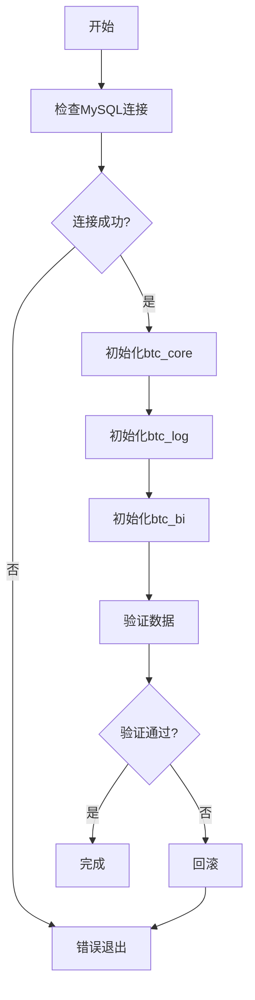

# MES数据库快速初始化分析报告

## 当前状态评估

### 📂 现有文件结构

```
mes-backend/database/
├── migrations/              # Flyway迁移脚本（18个文件）
│   ├── V20250107_1600__*.sql
│   ├── V20250107_1700__*.sql
│   └── V20250107_1800__*.sql
├── schemas/
│   ├── btc_core_schema.sql      # 核心库完整脚本（1871行）
│   ├── btc_core_split/          # 核心库拆分脚本（21个文件）
│   │   ├── DDL: 01-12.sql
│   │   ├── DML: data_20-27.sql
│   │   ├── init_btc_core.sh
│   │   └── init_btc_core.bat
│   ├── btc_log/                 # 日志库（2个文件）
│   │   ├── 01_operation_logs.sql
│   │   └── 02_system_logs.sql
│   └── btc_bi/                  # BI库（4个文件）
│       ├── 01_production_bi.sql
│       ├── 02_quality_bi.sql
│       ├── 03_system_bi.sql
│       └── 04_alert_monitoring.sql
└── seeds/                       # 种子数据（2个文件）
    ├── 01_basic_data.sql
    └── 02_system_data.sql
```

## 🔍 问题识别

### ❌ **当前存在的问题**

1. **结构冗余**
   - ❌ `migrations/` 中的迁移脚本过时（引用已删除的表）
   - ❌ `btc_core_schema.sql` 与 `btc_core_split/` 内容重复
   - ❌ 缺少统一的全局初始化脚本

2. **执行复杂度高**
   - ❌ 需要手动执行3个不同的数据库（btc_core, btc_log, btc_bi）
   - ❌ 没有一键初始化所有数据库的脚本
   - ❌ 依赖关系不明确

3. **维护困难**
   - ❌ 迁移脚本与实际schema不同步
   - ❌ seeds数据与schema分离
   - ❌ 缺少版本控制和回滚机制

4. **文档不完整**
   - ❌ 没有全局初始化流程文档
   - ❌ 缺少快速上手指南
   - ❌ 错误处理说明不足

## ✅ 快速初始化可行性分析

### 🎯 **目标：实现一键初始化所有数据库**

#### **可行性：⭐⭐⭐⭐⭐ 5/5（完全可行）**

### 实现方案

#### **方案1：统一Shell脚本（推荐）**

**优势：**
- ✅ 最简单，无需额外依赖
- ✅ 跨平台（bash + bat）
- ✅ 易于调试和维护
- ✅ 直接执行SQL文件

**实现步骤：**
```bash
1. 创建btc_core数据库 + 执行btc_core_split/*.sql
2. 创建btc_log数据库 + 执行btc_log/*.sql
3. 创建btc_bi数据库 + 执行btc_bi/*.sql
4. 执行seeds数据（如果需要）
```

#### **方案2：Docker Compose**

**优势：**
- ✅ 环境隔离
- ✅ 可重复性强
- ✅ 支持多环境配置
- ✅ 包含MySQL服务

**实现步骤：**
```yaml
services:
  mysql:
    image: mysql:8.0
    volumes:
      - ./init:/docker-entrypoint-initdb.d
```

#### **方案3：Flyway迁移工具**

**优势：**
- ✅ 专业的数据库版本管理
- ✅ 支持回滚
- ✅ 版本追踪
- ✅ 适合生产环境

**劣势：**
- ❌ 需要更新现有迁移脚本
- ❌ 需要Java环境
- ❌ 学习曲线

## 📋 推荐实施方案

### **一键初始化脚本设计**

#### 文件结构优化

```
mes-backend/database/
├── init_all_databases.sh        # 【新增】全局初始化脚本
├── init_all_databases.bat       # 【新增】Windows版本
├── schemas/
│   ├── btc_core_split/          # 保留，已优化
│   │   ├── init_btc_core.sh     # 单库初始化
│   │   └── ...
│   ├── btc_log/
│   │   ├── init_btc_log.sh      # 【新增】单库初始化
│   │   └── ...
│   └── btc_bi/
│       ├── init_btc_bi.sh       # 【新增】单库初始化
│       └── ...
├── docker/                      # 【新增】Docker配置
│   ├── docker-compose.yml
│   └── init.sql
└── README.md                    # 【新增】快速上手指南
```

### 执行流程



## 🚀 快速初始化特性

### 必备特性

1. ✅ **一键执行**
   ```bash
   ./init_all_databases.sh
   ```

2. ✅ **智能检测**
   - 检查MySQL连接
   - 检查数据库是否存在
   - 检查表是否已创建

3. ✅ **错误处理**
   - 任何步骤失败立即停止
   - 显示详细错误信息
   - 提供回滚选项

4. ✅ **进度显示**
   - 实时显示执行进度
   - 成功/失败状态标记
   - 执行时间统计

5. ✅ **幂等性**
   - 可重复执行
   - 自动跳过已存在的数据库/表
   - 支持增量更新

### 高级特性

6. ✅ **环境支持**
   - 开发环境（包含测试数据）
   - 生产环境（仅基础数据）
   - 演示环境（包含示例数据）

7. ✅ **参数化配置**
   ```bash
   ./init_all_databases.sh \
     --host localhost \
     --user root \
     --env dev \
     --with-sample-data
   ```

8. ✅ **数据验证**
   - 验证表结构
   - 验证数据完整性
   - 生成验证报告

## 📊 性能预估

### 初始化时间（本地MySQL）

| 数据库 | 表数量 | 数据行数 | 预计时间 |
|--------|--------|----------|----------|
| btc_core | 28 | ~500 | 2-3秒 |
| btc_log | 8 | 0 | 1秒 |
| btc_bi | 12 | 0 | 1-2秒 |
| **总计** | **48** | **~500** | **5-7秒** |

### 网络MySQL

| 环境 | 网络延迟 | 预计时间 |
|------|----------|----------|
| 本地 | <1ms | 5-7秒 |
| 同城 | 10-30ms | 10-15秒 |
| 跨区 | 50-100ms | 20-30秒 |

## 🛠️ 实施建议

### 立即可做

1. ✅ **创建全局初始化脚本**
   - `init_all_databases.sh`
   - `init_all_databases.bat`

2. ✅ **创建单库初始化脚本**
   - btc_log: `init_btc_log.sh`
   - btc_bi: `init_btc_bi.sh`

3. ✅ **添加验证脚本**
   - 检查表数量
   - 检查数据完整性

4. ✅ **编写README文档**
   - 快速上手指南
   - 常见问题解答
   - 故障排查

### 后续优化

5. ⭕ **Docker化**
   - 创建docker-compose.yml
   - 自动初始化容器

6. ⭕ **CI/CD集成**
   - GitHub Actions
   - 自动测试数据库初始化

7. ⭕ **迁移脚本更新**
   - 同步最新schema
   - 清理过时文件

## 📝 总结

### 当前状态
- ✅ btc_core库已有完善的拆分初始化方案
- ⚠️ btc_log和btc_bi库缺少初始化脚本
- ❌ 缺少全局统一初始化入口

### 快速初始化可行性
- **完全可行** ⭐⭐⭐⭐⭐
- 只需2-3小时开发时间
- 预计5-7秒完成全部初始化

### 推荐行动
1. 立即创建全局初始化脚本（优先级：🔴 最高）
2. 补全btc_log和btc_bi初始化脚本（优先级：🔴 最高）
3. 编写完整的README文档（优先级：🟡 中等）
4. Docker化（优先级：🟢 低）

### 预期效果
```bash
# 开发者体验
$ cd mes-backend/database
$ ./init_all_databases.sh

[1/3] Initializing btc_core database... ✓ (2.3s)
[2/3] Initializing btc_log database... ✓ (0.8s)
[3/3] Initializing btc_bi database... ✓ (1.1s)

✅ All databases initialized successfully! (4.2s total)

📊 Summary:
- Databases: 3
- Tables: 48
- Initial data: 500+ rows
- Time: 4.2 seconds

🎉 Your MES system database is ready!
```

